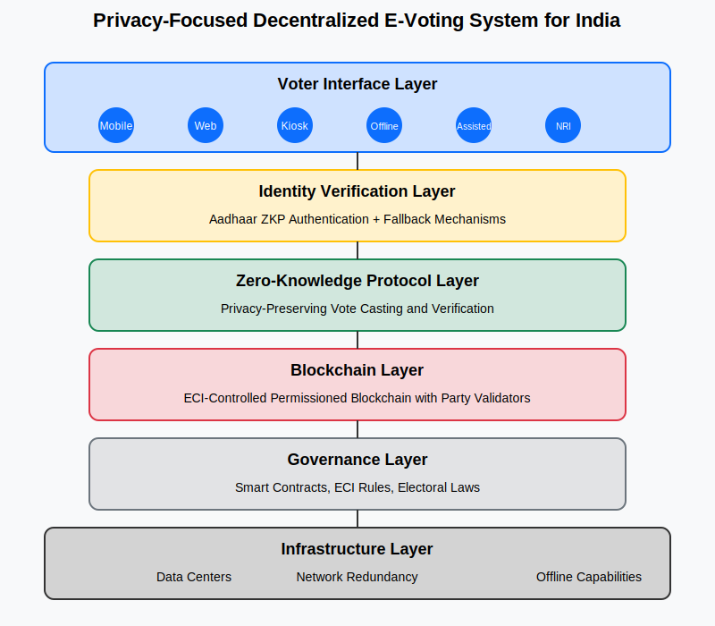

# Matdaan - Decentralized Voting System

A privacy-preserving decentralized voting system using zero-knowledge proofs.



## Features

- Mock Aadhaar verification
- Zero-knowledge proof based voting
- Hindi and English language support
- Mobile-responsive design
- Local blockchain development

## Prerequisites

- Node.js >= 18
- pnpm >= 8
- Docker and Docker Compose

## Project Structure

```
matdaan/
├── contracts/     # Smart contracts
├── frontend/      # React application
├── backend/       # Express server
└── docker/        # Docker configuration
```

## Setup

1. Install dependencies:
   ```bash
   pnpm install
   ```

2. Start the development environment:
   ```bash
   pnpm dev
   ```

This will start:
- Frontend development server
- Backend API server
- Local blockchain network

## Development

- Frontend: `pnpm dev:frontend`
- Backend: `pnpm dev:backend`
- Contracts: `pnpm dev:contracts`

## License

MIT 
